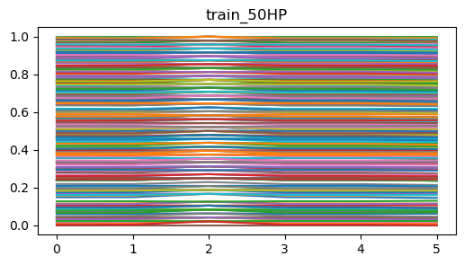
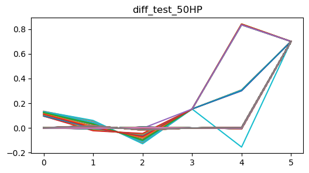

# AirCompressor_anomaly_detection_AIFACTORY
https://aifactory.space/competition/detail/2226

- Airflow를 이용하여 ETL 파이프라인 구성 후, WandB로 모델링 모니터링.
- 참가 팀명: 신길동토니스타크
- F1 Score: 0.956 (Private)
- 총 803명의 참가자 중, 공동 **22등** 달성.

 
 

**대회 주제**\
■ 범천(주)은 ESG 가치를 담아 산업용 공기압축기를 개발하는 대덕연구개발특구 소재 기업입니다.

- 제4회 연구개발특구 AI SPARK 챌린지는 산업기기 피로도를 예측하는 문제입니다.
- 산업용 공기압축기 및 회전기기에서 모터 및 심부 온도, 진동, 노이즈 등은 기기 피로도에 영향을 주는 요소이며, 피로도 증가는 장비가 고장에 이르는 원인이 됩니다.
- 피로도 증가 시 데이터 학습을 통해 산업기기 이상 전조증상을 예측하여 기기 고장을 예방하고 그로 인한 사고를 예방하는 모델을 개발하는 것이 이번 대회의 목표입니다.

<h2> 산업용 공기압축기의 이상 유무를 비지도학습 방식을 이용하여 판정 </h2>

 

**모델 조건**
1. 본 대회의 모델링은 비지도학습 방식으로 진행됩니다.

2. 향후 실시간 판정에 활용될 수 있도록, 개발된 모델은 다음의 조건을 충족하여야 합니다.

- 입력된 데이터를 정상(0), 이상(1)로 구분하는 이진 분류 모델이어야 합니다.
- 시간 단위로 생성되는 입력 데이터에 대하여 판정을 수행할 수 있는 모델이어야 합니다.
- 신규 데이터로 학습/개선이 가능한 모델이어야 합니다.
- 총 8개의 대상 설비를 모델링하면서, 설비별로 별도의 모델을 학습하는 것은 허용되나 모두 동일한 아키텍처를 사용해야 합니다.
(예: 설비 1에 사용한 모델 구조를 나머지 설비에도 사용하여야 함)

 

**데이터 구성**
   
air_inflow: 공기 흡입 유량 (^3/min)   
air_end_temp: 공기 말단 온도 (°C)   
out_pressure: 토출 압력 (Mpa)   
motor_current: 모터 전류 (A)   
motor_rpm: 모터 회전수 (rpm)   
motor_temp: 모터 온도 (°C)   
motor_vibe: 모터 진동 (mm/s)   
type: 설비 번호   

설비 번호 [0, 4, 5, 6, 7]: 30HP(마력)   
설비 번호 1: 20HP   
설비 번호 2: 10HP   
설비 번호 3: 50HP   

<h2> EDA 요약 </h2>
 
<h3> train dataset에 대한 pair plot </h3>

 
<h3> test dataset에 대한 pair plot </h3>

- train셋은 모두 정상이며, 타입별로 선형 기울기가 다름.
- motor_vibe 컬럼에서의 이상치 제거 필요.

 
<h3> 타입별 heatmap </h3>

- 마력별로 구분했을 때, 변수들간의 상관관계가 모두 1을 나타냄.

 
<h3> 타입별 추이 </h3>

- 스케일링 진행.

<h2> Preprocessing </h2>

1. Type을 마력별로 정리.

2. Scaling

    
    
    

    
    
    

    
    
    
    

    
    

- 이상치의 경우, 컬럼 중 값이 튀는 부분이 존재.
- 이를 모든 데이터에 대해 캐치하기 위해 normalization 진행.
 
3. **Normalization**

- 이웃 컬럼에 대한 기울기를 구하여 일반화 진행.
- 마지막 컬럼에 out_pressure 컬럼을 추가함으로써, 모든 타입을 하나로 통합할 수 있음.

    
    
    

    
    
    

    
    
    

    
    

<h2> 모델링 결과 </h2>
- 각 모델링은 각각의 ipynb 파일 참조.

- train -> 청색
- test -> 적색

<h2> Airflow </h2>

- version 1
    

- version 2
    

    - AutoEncoder + DeepSVDD + 다른 모델링을 병렬로 처리했으면 좋았겠지만, 다른 개인적인 스케쥴로 인해 진행안함.